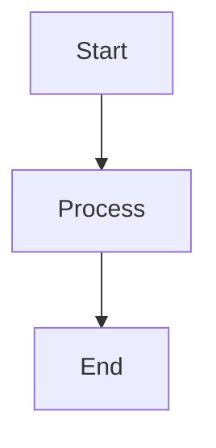
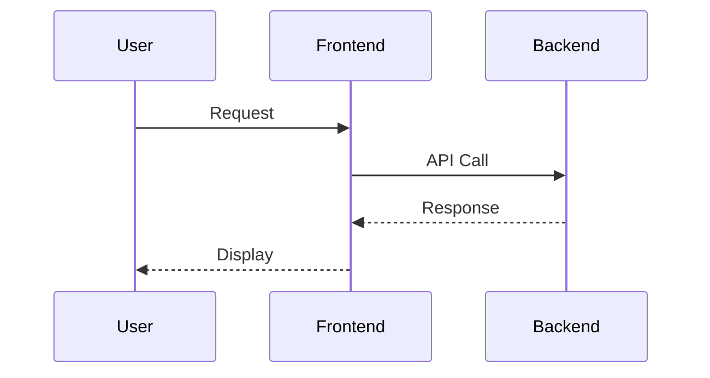

# 📊 Documentation BachataVibe - Graphiques et Diagrammes

## 🎯 Vue d'ensemble

Cette documentation contient tous les graphiques, diagrammes et visualisations de l'application BachataVibe. Elle est organisée en sections thématiques pour faciliter la navigation.

## 📁 Structure des documents

### 🏗️ [Architecture générale](architecture-diagram.md)
- **Architecture de l'application** : Vue d'ensemble du système
- **Flux de données API** : Séquence des appels API
- **Configuration des environnements** : Local vs Production
- **Flux de build et déploiement** : Processus de mise en production
- **Structure des composants React** : Organisation du frontend
- **Structure de la base de données** : Schéma ERD
- **Flux d'authentification** : Processus de connexion
- **Métriques et monitoring** : Surveillance de l'application
- **Pipeline de déploiement** : Automatisation du déploiement

### 📈 [Métriques de performance](performance-metrics.md)
- **Temps de chargement des pages** : Gantt des performances
- **Utilisation des ressources** : Répartition des ressources
- **Flux de données par page** : Traitement des données
- **Responsive Design Breakpoints** : Adaptation mobile/desktop
- **Performance de la base de données** : Optimisation des requêtes
- **Configuration réseau** : Architecture réseau
- **Métriques d'utilisation** : Statistiques utilisateurs
- **Architecture de déploiement** : Infrastructure de déploiement
- **Évolution des fonctionnalités** : Roadmap du projet
- **Objectifs de performance** : Cibles de performance

### 🎨 [Wireframes et flux utilisateur](ui-wireframes.md)
- **Structure de navigation** : Arborescence des pages
- **Page d'accueil - Layout** : Structure de la page principale
- **Page Compétitions - Layout** : Interface des compétitions
- **Page Événements - Layout** : Interface des événements
- **Page de profil utilisateur** : Interface utilisateur
- **Pages d'authentification** : Connexion/Inscription
- **Responsive Design - Breakpoints** : Adaptation mobile
- **Système de couleurs** : Palette de couleurs
- **Flux d'inscription** : Processus d'inscription
- **Dashboard administrateur** : Interface d'administration
- **Call-to-Actions principaux** : Boutons d'action

### 🚀 [Infrastructure et déploiement](deployment-infrastructure.md)
- **Architecture de déploiement** : Vue d'ensemble de l'infrastructure
- **Pipeline de déploiement** : Processus automatisé
- **Configuration réseau** : Architecture réseau
- **Monitoring et observabilité** : Surveillance système
- **Sécurité et authentification** : Mesures de sécurité
- **Scalabilité et performance** : Stratégies d'évolutivité
- **Gestion des données** : Traitement et stockage
- **Backup et récupération** : Stratégies de sauvegarde
- **Métriques de déploiement** : Timeline de déploiement
- **Objectifs de performance** : Cibles de performance
- **Configuration des environnements** : Dev/Staging/Prod

## 🛠️ Outils utilisés

- **Mermaid** : Diagrammes et graphiques
- **Markdown** : Documentation
- **ASCII Art** : Schémas textuels
- **Gantt Charts** : Planning et timelines
- **Flowcharts** : Flux de processus
- **ERD** : Diagrammes de base de données
- **Sequence Diagrams** : Interactions système

## 📋 Comment utiliser cette documentation

### **Pour les développeurs**
1. Consultez l'[architecture générale](architecture-diagram.md) pour comprendre le système
2. Référez-vous aux [wireframes](ui-wireframes.md) pour l'interface utilisateur
3. Utilisez les [métriques de performance](performance-metrics.md) pour l'optimisation

### **Pour les administrateurs**
1. Consultez l'[infrastructure et déploiement](deployment-infrastructure.md)
2. Référez-vous aux métriques de monitoring
3. Utilisez les stratégies de backup et récupération

### **Pour les stakeholders**
1. Consultez la [roadmap](performance-metrics.md#évolution-des-fonctionnalités)
2. Référez-vous aux objectifs de performance
3. Utilisez les métriques d'utilisation

## 🔄 Mise à jour de la documentation

Cette documentation est mise à jour automatiquement lors des changements de code. Pour ajouter de nouveaux graphiques :

1. **Créez le diagramme** dans le fichier approprié
2. **Utilisez Mermaid** pour la syntaxe
3. **Testez le rendu** avec un visualiseur Mermaid
4. **Mettez à jour l'index** si nécessaire

## 📊 Exemples de diagrammes

### **Diagramme simple**

### **Diagramme de séquence**

### **Diagramme de Gantt**

```mermaid
gantt
    title Project Timeline
    dateFormat X
    axisFormat %d
    
    section Phase 1
    Task 1 :0, 5
    Task 2 :5, 10
    
    section Phase 2
    Task 3 :10, 15
    Task 4 :15, 20
```

## 🎯 Prochaines étapes

1. **Intégrer les graphiques** dans l'application
2. **Créer des dashboards** interactifs
3. **Ajouter des métriques** en temps réel
4. **Implémenter des alertes** automatiques
5. **Optimiser les performances** basées sur les métriques

---

*Cette documentation est générée automatiquement et mise à jour en continu.*

