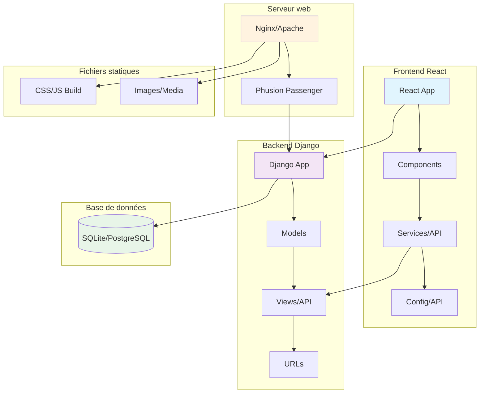
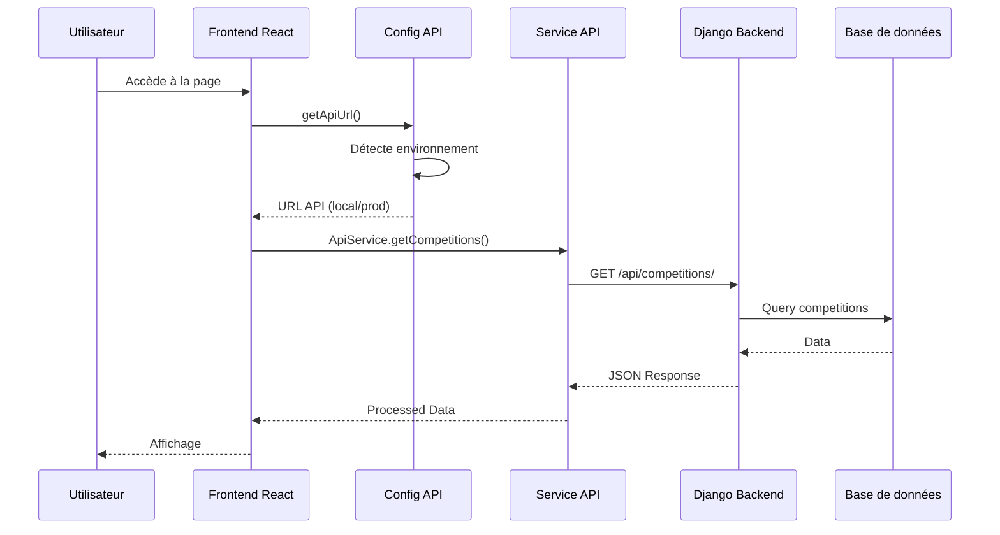
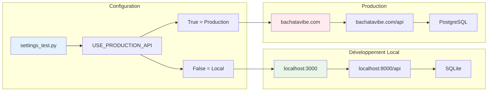
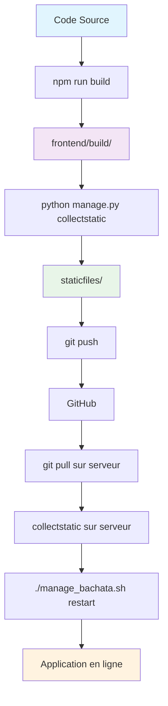
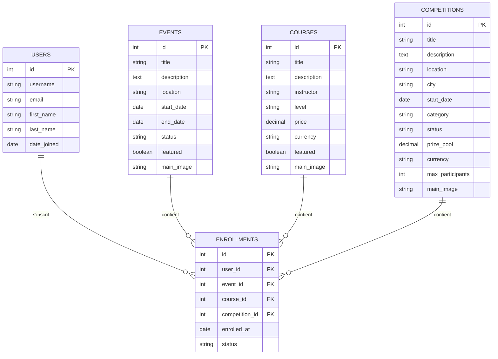
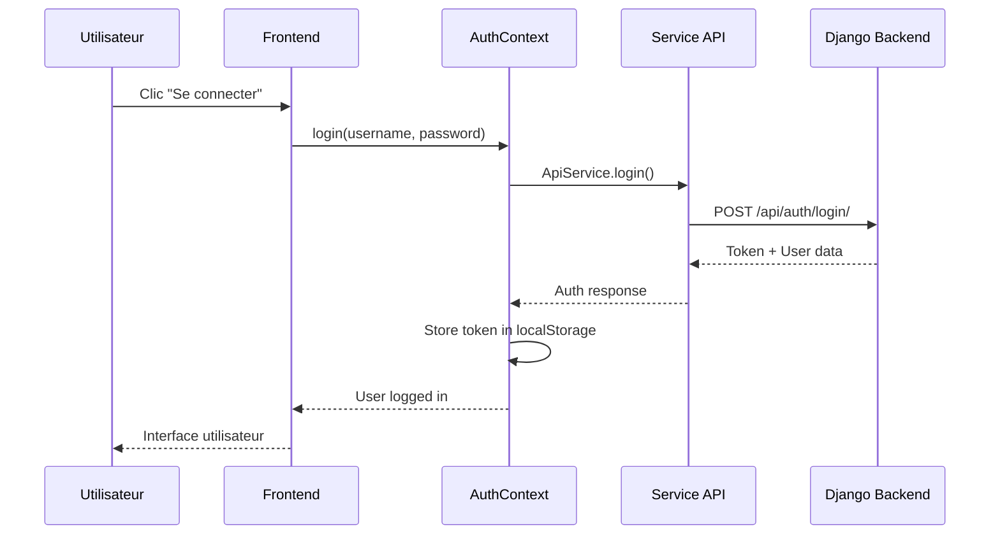
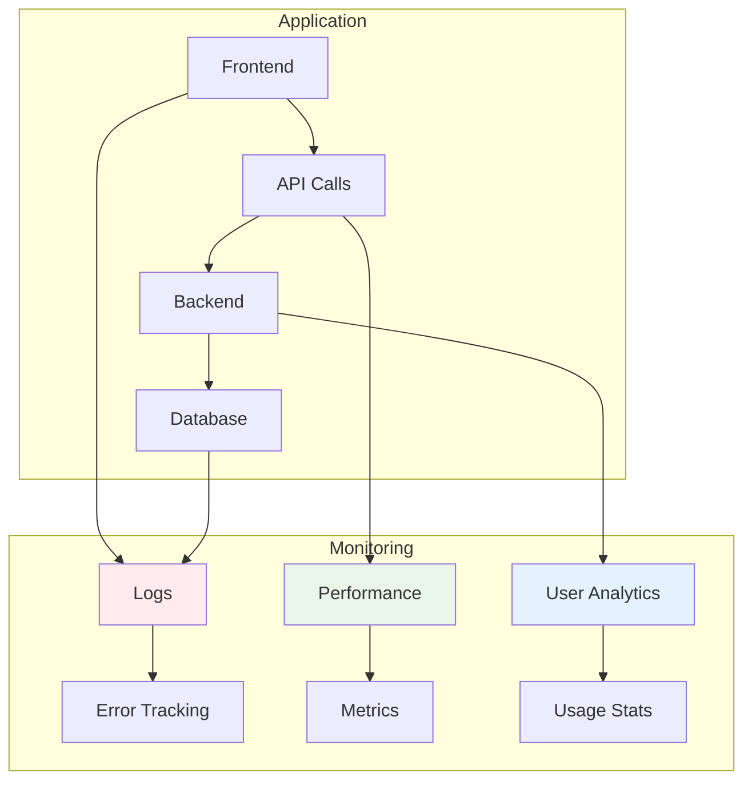
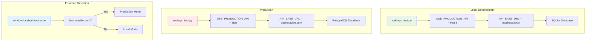

# 📊 Diagrammes d'architecture - BachataVibe

## 🏗️ Architecture générale



## 🔄 Flux de données API



## 🌐 Configuration des environnements



## 🔧 Flux de build et déploiement



## 📱 Structure des composants React

```mermaid
graph TD
    A[App.js] --> B[Router]
    B --> C[HomePage]
    B --> D[CompetitionsPage]
    B --> E[EventsPage]
    B --> F[CoursesPage]
    B --> G[AuthContext]
    
    D --> H[ApiService]
    E --> H
    F --> H
    G --> H
    
    H --> I[config/api.js]
    I --> J[getApiUrl()]
    J --> K[Mode Local]
    J --> L[Mode Production]
    
    style A fill:#e1f5fe
    style H fill:#f3e5f5
    style I fill:#e8f5e8
```

## 🗄️ Structure de la base de données



## 🔐 Flux d'authentification



## 📊 Métriques et monitoring



## 🚀 Pipeline de déploiement

```mermaid
graph LR
    A[Code Changes] --> B[Local Testing]
    B --> C[npm run build]
    C --> D[collectstatic]
    D --> E[git commit]
    E --> F[git push]
    F --> G[GitHub]
    G --> H[Server Pull]
    H --> I[Server collectstatic]
    I --> J[Restart App]
    J --> K[Health Check]
    K --> L[Deployment Complete]
    
    style A fill:#e1f5fe
    style C fill:#f3e5f5
    style G fill:#e8f5e8
    style L fill:#fff3e0
```



## 🔧 Configuration des environnements



Ces diagrammes vous donnent une vue d'ensemble complète de votre architecture BachataVibe ! 🎯


