# 🚀 Infrastructure et déploiement - BachataVibe

## 🏗️ Architecture de déploiement

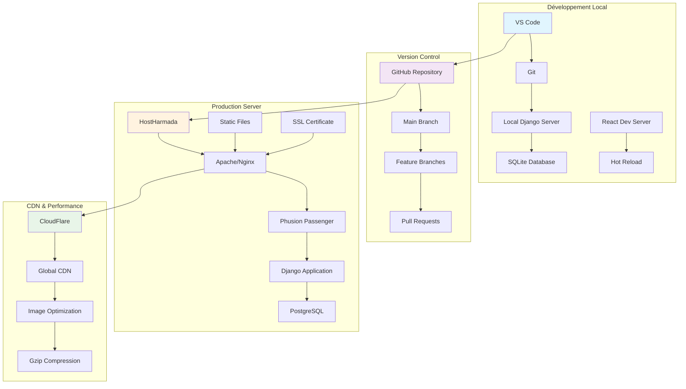

## 🔄 Pipeline de déploiement

```mermaid
graph LR
    A[Code Changes] --> B[Local Testing]
    B --> C[Git Commit]
    C --> D[Git Push]
    D --> E[GitHub Webhook]
    E --> F[Server Pull]
    F --> G[Build Frontend]
    G --> H[Collect Static]
    H --> I[Database Migration]
    I --> J[Restart App]
    J --> K[Health Check]
    K --> L[Deployment Complete]
    
    style A fill:#e1f5fe
    style E fill:#f3e5f5
    style K fill:#e8f5e8
    style L fill:#fff3e0
```

## 🌐 Configuration réseau

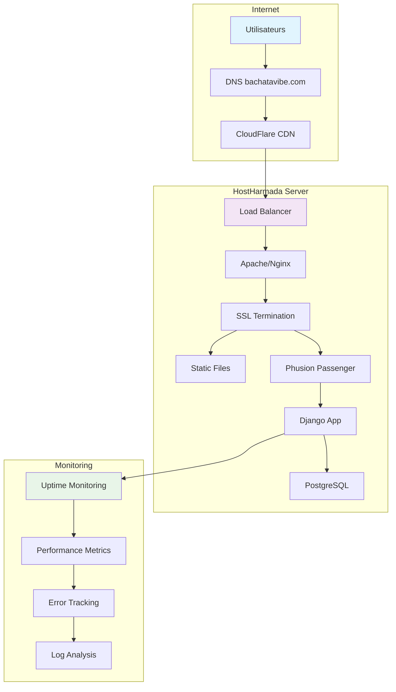

## 📊 Monitoring et observabilité

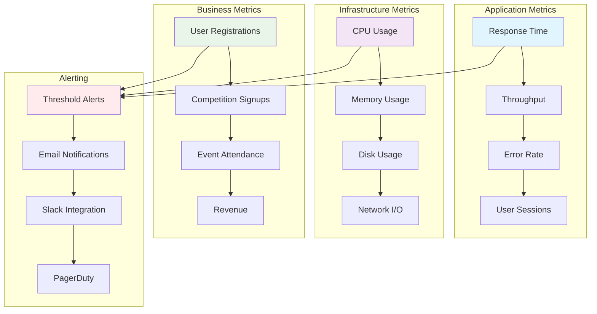

## 🔐 Sécurité et authentification

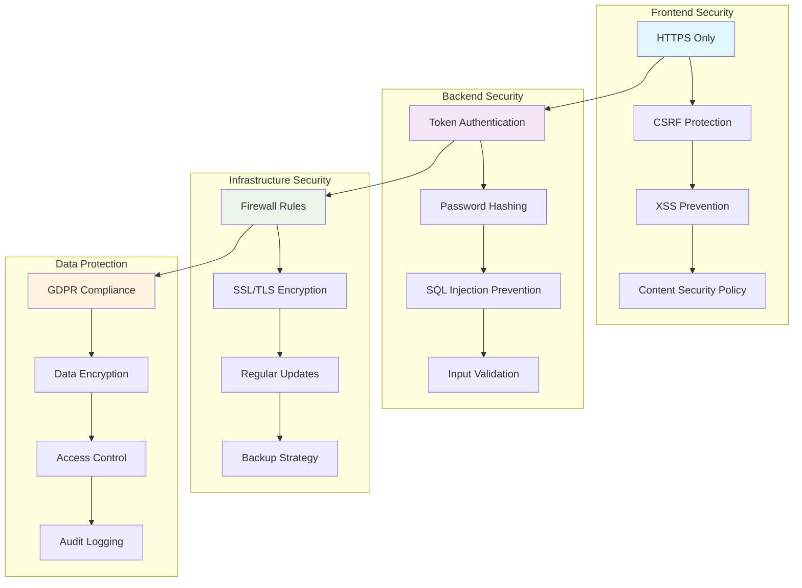

## 📈 Scalabilité et performance

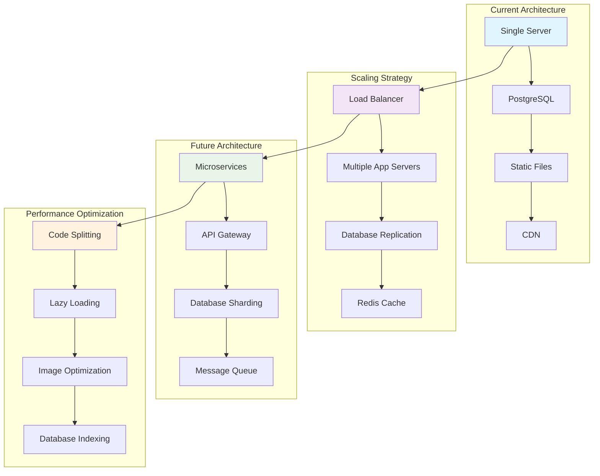

## 🗄️ Gestion des données

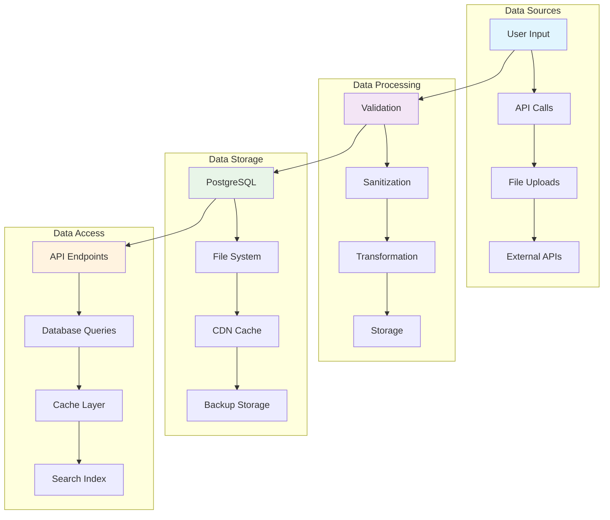

## 🔄 Backup et récupération

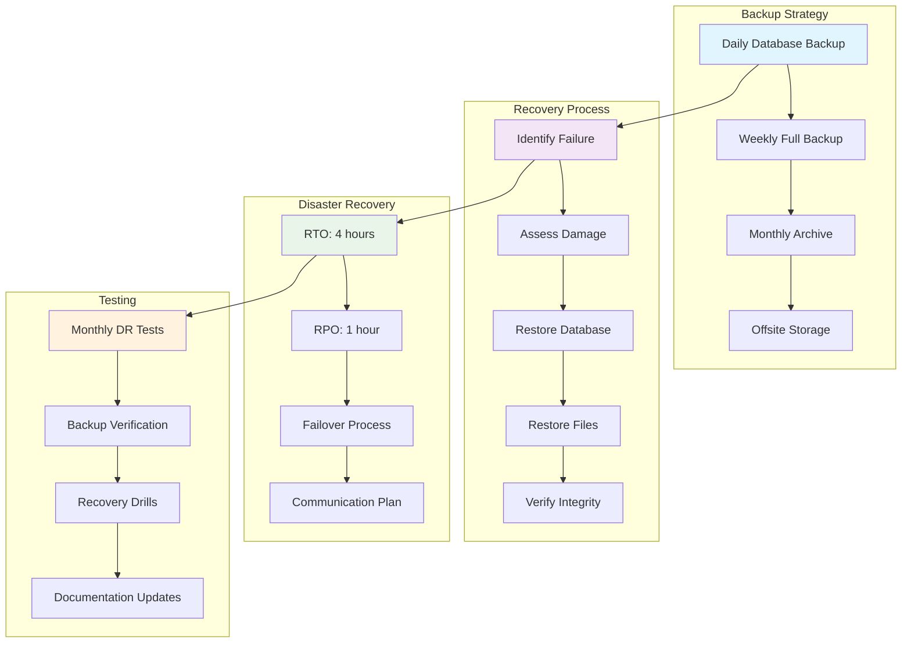

## 📊 Métriques de déploiement

```mermaid
gantt
    title Timeline de déploiement
    dateFormat X
    axisFormat %H:%M
    
    section Phase 1
    Code Review        :0, 30
    Testing           :30, 60
    Build             :60, 90
    
    section Phase 2
    Deploy to Staging :90, 120
    Integration Tests :120, 150
    User Acceptance   :150, 180
    
    section Phase 3
    Deploy to Prod    :180, 210
    Health Checks     :210, 240
    Monitoring        :240, 300
```

## 🎯 Objectifs de performance

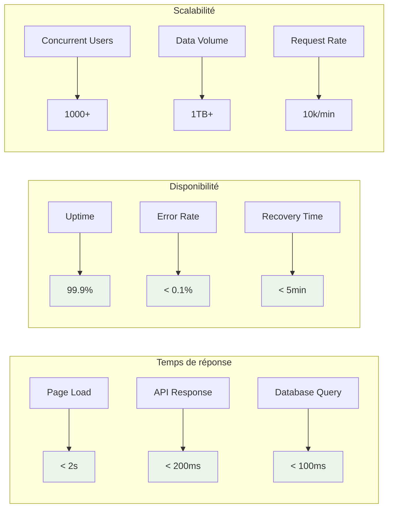

## 🔧 Configuration des environnements

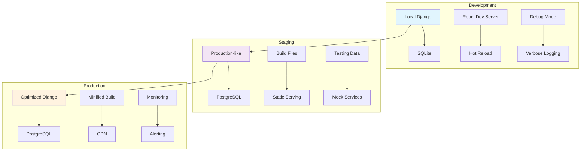

Ces graphiques vous donnent une vision complète de l'infrastructure et du déploiement de votre application BachataVibe ! 🚀✨

## ⚙️ Mode développement du frontend

Pour connecter un serveur React en développement (hot reload) au backend Django:

- Activez le mode via les settings Django:

```12:22:bachata_site/settings.py
# Frontend dev mode configuration
FRONTEND_DEV_MODE = config('FRONTEND_DEV_MODE', default=False, cast=bool)
FRONTEND_DEV_URL = config('FRONTEND_DEV_URL', default='http://localhost:3000')
```

- En développement, ces valeurs sont déjà définies:

```10:18:bachata_site/settings_dev.py
# Frontend dev server configuration
FRONTEND_DEV_MODE = True
FRONTEND_DEV_URL = 'http://localhost:3000'
```

- En production, le mode est désactivé:

```12:14:bachata_site/settings_production.py
FRONTEND_DEV_MODE = False
```

Impact:
- CORS autorise automatiquement `FRONTEND_DEV_URL` quand `FRONTEND_DEV_MODE` est actif.
- Lancez le frontend: `npm start` dans `frontend/` (React Dev Server)
- Backend: `python manage.py runserver 0.0.0.0:8000`

Optionnel: définissez via variables d'environnement (.env) côté Django:

```env
FRONTEND_DEV_MODE=True
FRONTEND_DEV_URL=http://localhost:3000
```

Alternative via `settings_test.py` (utilisé dans votre projet):

```140:169:bachata_site/settings_test.py
# Basculer entre API prod et locale
USE_PRODUCTION_API = False

# Flags explicites pour le front en dev
FRONTEND_DEV_MODE = not USE_PRODUCTION_API
FRONTEND_DEV_URL = 'http://localhost:3000'

# URLs selon le mode et CORS mis à jour
if USE_PRODUCTION_API:
    API_BASE_URL = 'https://bachatavibe.com/api'
    FRONTEND_BASE_URL = 'https://bachatavibe.com'
else:
    API_BASE_URL = 'http://localhost:8000/api'
    FRONTEND_BASE_URL = 'http://localhost:3000'

CORS_ALLOWED_ORIGINS = [FRONTEND_BASE_URL, 'http://localhost:3000', 'http://127.0.0.1:3000', 'http://localhost:8000', 'http://127.0.0.1:8000']
if FRONTEND_DEV_MODE and FRONTEND_DEV_URL not in CORS_ALLOWED_ORIGINS:
    CORS_ALLOWED_ORIGINS.append(FRONTEND_DEV_URL)
```


