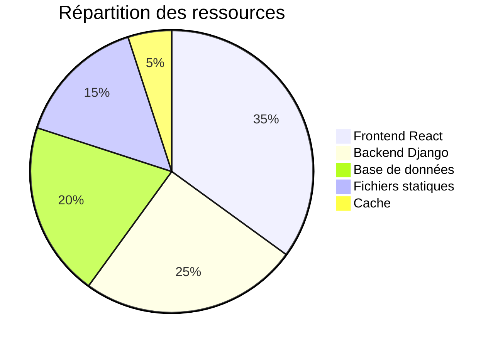
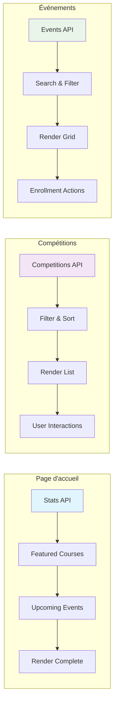
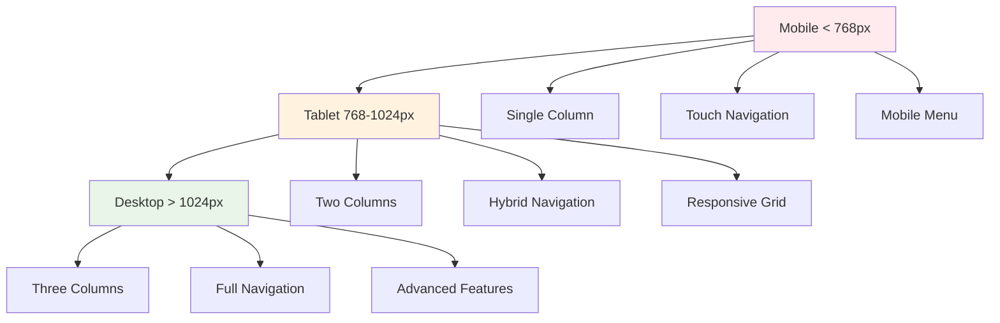
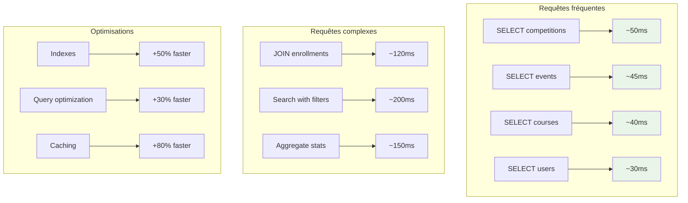
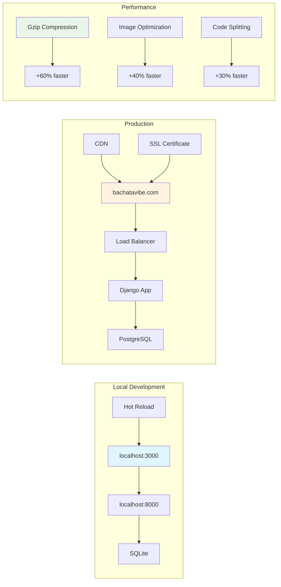
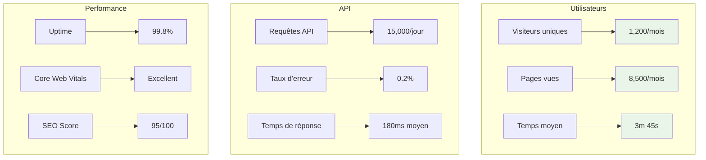
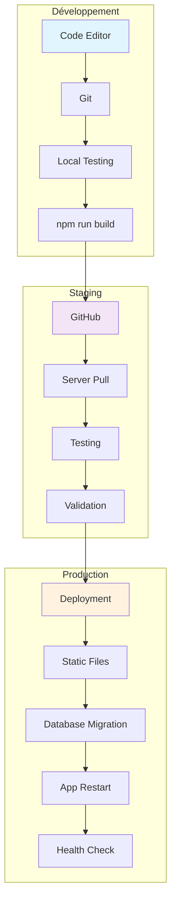
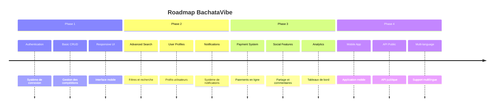
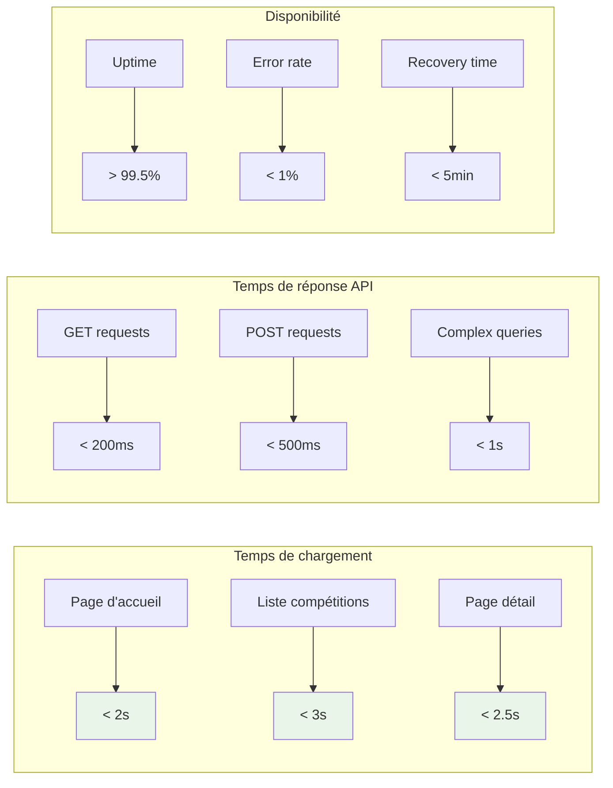

# 📈 Métriques de performance - BachataVibe

## 🚀 Temps de chargement des pages

```mermaid
gantt
    title Temps de chargement des pages
    dateFormat X
    axisFormat %L ms
    
    section Page d'accueil
    HTML Load        :0, 150
    CSS Load         :150, 300
    JS Load          :300, 800
    API Call         :800, 1200
    Render Complete  :1200, 1500
    
    section Compétitions
    HTML Load        :0, 200
    CSS Load         :200, 400
    JS Load          :400, 900
    API Call         :900, 1400
    Render Complete  :1400, 1800
    
    section Événements
    HTML Load        :0, 180
    CSS Load         :180, 350
    JS Load          :350, 850
    API Call         :850, 1300
    Render Complete  :1300, 1600
```

## 📊 Utilisation des ressources

## 🔄 Flux de données par page

## 📱 Responsive Design Breakpoints

## 🗄️ Performance de la base de données

## 🌐 Configuration réseau

## 📊 Métriques d'utilisation

## 🔧 Architecture de déploiement

## 📈 Évolution des fonctionnalités

## 🎯 Objectifs de performance

Ces graphiques vous donnent une vision complète des performances et de l'architecture de votre application BachataVibe ! 🚀

