# 🎨 Wireframes et flux utilisateur - BachataVibe

## 📱 Structure de navigation

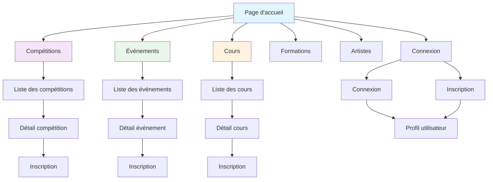

## 🏠 Page d'accueil - Layout

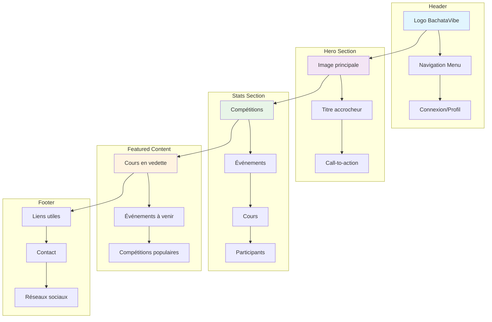

## 🏆 Page Compétitions - Layout

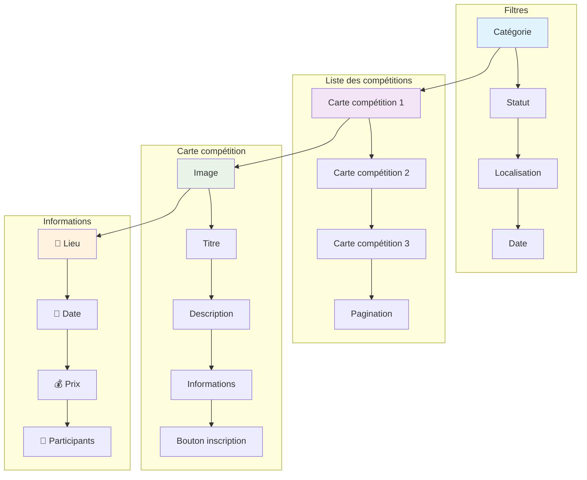

## 📅 Page Événements - Layout

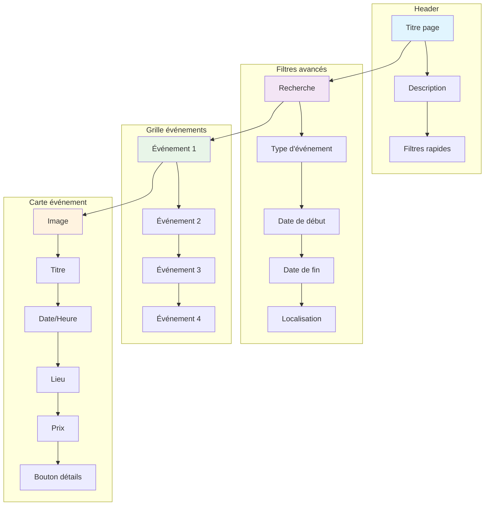

## 👤 Page de profil utilisateur

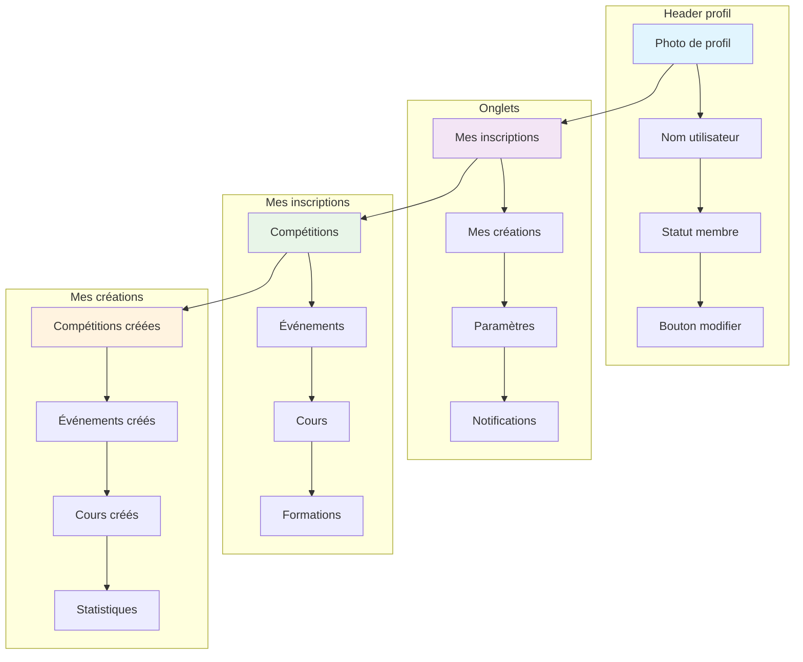

## 🔐 Pages d'authentification

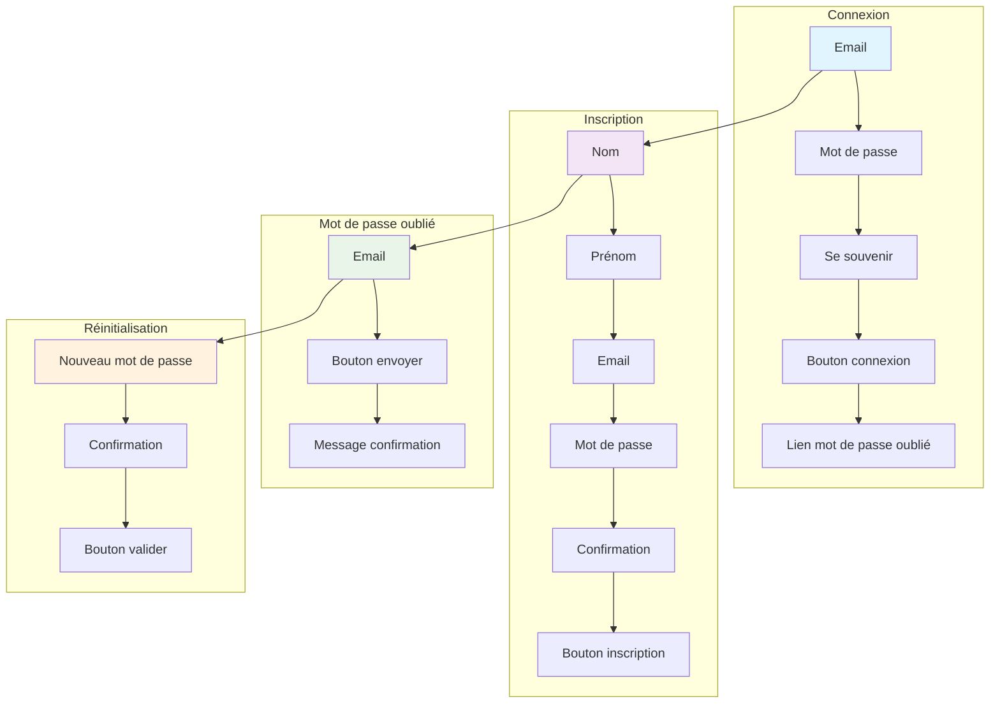

## 📱 Responsive Design - Breakpoints

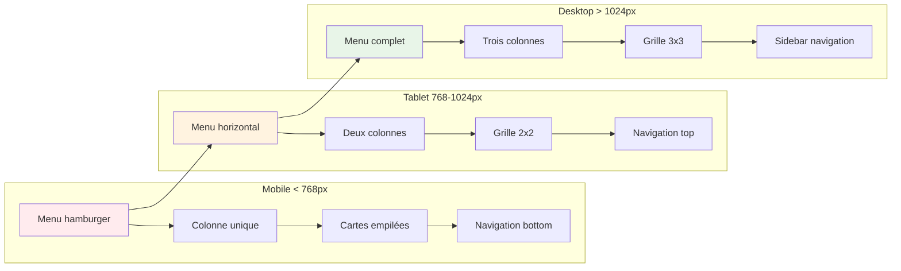

## 🎨 Système de couleurs

```mermaid
graph TB
    subgraph "Couleurs principales"
        A[Orange #F97316] --> B[Rouge #DC2626]
        B --> C[Blanc #FFFFFF]
        C --> D[Gris #6B7280]
    end
    
    subgraph "Couleurs secondaires"
        E[Vert #10B981] --> F[Bleu #3B82F6]
        F --> G[Violet #8B5CF6]
        G --> H[Jaune #F59E0B]
    end
    
    subgraph "Couleurs d'état"
        I[Succès #10B981] --> J[Erreur #EF4444]
        J --> K[Avertissement #F59E0B]
        K --> L[Info #3B82F6]
    end
    
    style A fill:#F97316,color:#fff
    style B fill:#DC2626,color:#fff
    style E fill:#10B981,color:#fff
    style I fill:#10B981,color:#fff
```

## 🔄 Flux d'inscription à une compétition

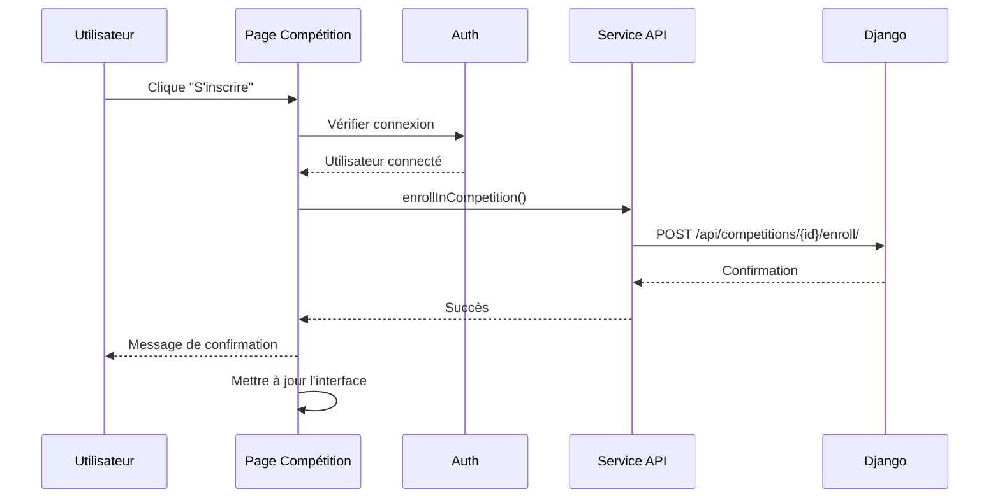

## 📊 Dashboard administrateur

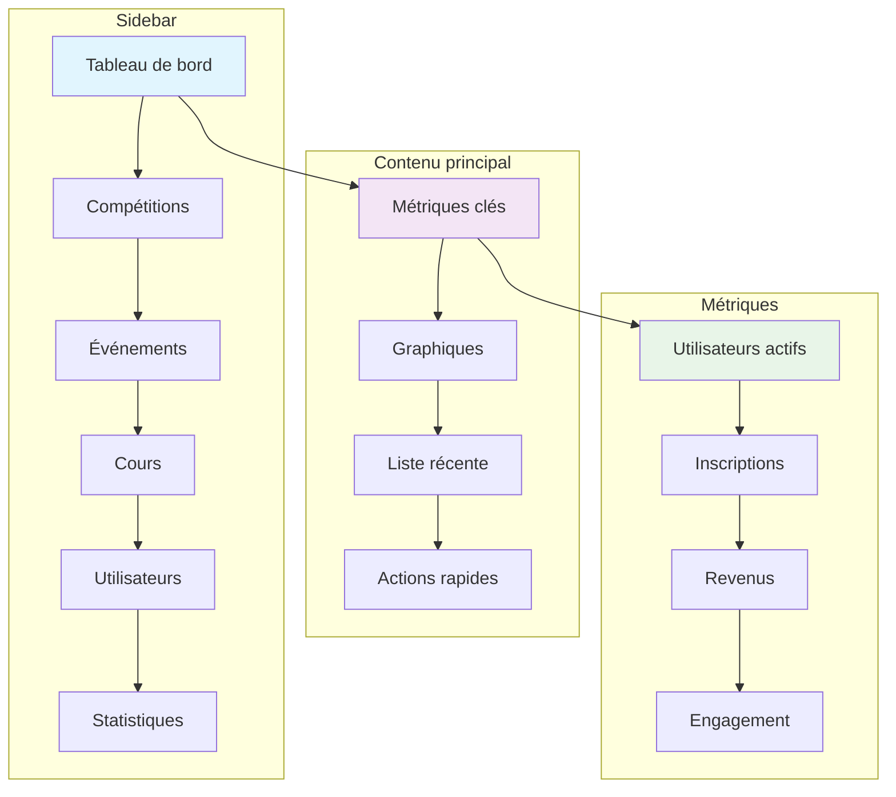

## 🎯 Call-to-Actions principaux

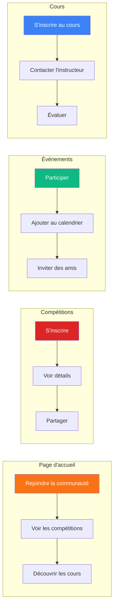

Ces wireframes et flux utilisateur vous donnent une vision complète de l'expérience utilisateur de votre application BachataVibe ! 🎨✨

